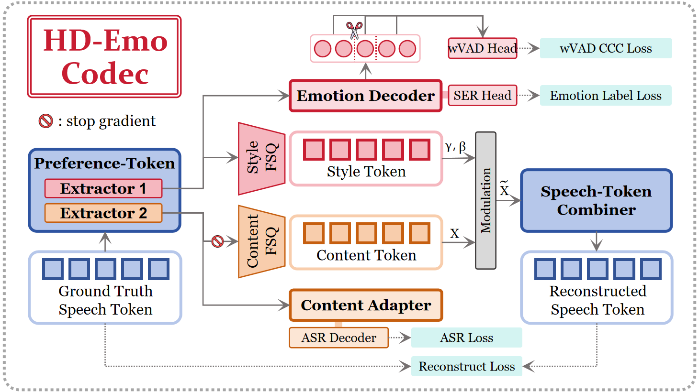

# 🎭 HD-Emo: An Emotional Speech Codec for Preference Extraction

<div align="center">

[](https://arxiv.org/abs/2606.28249)
[](https://xxh333.github.io/hpro-demo/)
[](https://huggingface.co/XXH333/HD-Emo)
[](https://www.python.org/)

**Official implementation of the HD-Emo Codec introduced in  
“HPRO: Hierarchical Progressive Reward Optimization via Preference Extraction for Emotional Text-to-Speech.”**

</div>

---

## 📖 Overview

**HD-Emo** is an emotional speech codec designed to extract content and emotional representations from s3 speech tokens.

Given an input utterance, HD-Emo extracts:

- **Frame-level content preference tokens**
- **Frame-level style preference tokens**
- **Word-level VAD predictions** (Valence, Arousal, and Dominance)
- **Sentence-level emotion predictions** across 9 classes
- **ASR transcription** of the utterance

The codec employs two preference extractors with Finite Scalar Quantization (FSQ) bottlenecks. The content stream is supervised by automatic speech recognition, while the style stream is supervised by hierarchical emotional objectives, including sentence-level speech emotion recognition and word-level VAD prediction.

> **Note:** The current open-source implementation provides feature and preference extraction only. Audio reconstruction from the extracted tokens is not supported.

---

## 🏗️ Architecture



*Overview of the HD-Emo Codec. Monotonic speech tokens are processed by dual preference extractors with FSQ bottlenecks to obtain content and style preference tokens. The two streams are respectively supervised by ASR and hierarchical emotional objectives (SER and wVAD), and subsequently fused via dynamic feature modulation for speech token reconstruction.*

---

## ✨ Key Features

### Dual Preference Extraction

HD-Emo separates speech representations into two complementary preference streams:

- **Content preference tokens**, which capture linguistic and semantic information
- **Style preference tokens**, which capture emotional and expressive information

### Hierarchical Emotion Understanding

The codec models emotional information at multiple temporal levels:

- **Frame level:** style preference representations
- **Word level:** Valence-Arousal-Dominance predictions
- **Sentence level:** 9-class speech emotion recognition

### Integrated ASR Transcription

HD-Emo includes an ASR branch based on Whisper to obtain the transcription of the input utterance and supervise the content preference space.

### English Speech Support

The released model currently supports **English speech only**.

---

## 🛠️ Installation

We recommend using Conda to manage the Python environment.

### 1. Create and activate the environment

```bash
conda create -n hdemo python=3.10 -y
conda activate hdemo
```

### 2. Clone the repository

```bash
git clone https://github.com/XXH333/HD-EMO.git
cd HD-EMO
```

### 3. Install dependencies

```bash
pip install -e .
```

> On Linux, the PyPI `torch` wheels ship with CUDA support. To match a specific CUDA version, install PyTorch first. For example:
>
> ```bash
> pip install torch torchaudio --index-url https://download.pytorch.org/whl/cu121
> ```
>
> Then install HD-Emo:
>
> ```bash
> pip install -e .
> ```

---

## 📥 Download Pretrained Models

Run the following script to download the HD-Emo checkpoint and its required pretrained models:

```bash
./download_pretrained_models.sh
```

All models will be downloaded into the `pretrained_models/` directory:

| Path | Source | Description |
|---|---|---|
| `HD-Emo/model.pt` | [Hugging Face: XXH333/HD-Emo](https://huggingface.co/XXH333/HD-Emo) | HD-Emo codec checkpoint |
| `CosyVoice2-0.5B/speech_tokenizer_v2.onnx` | ModelScope: `iic/CosyVoice2-0.5B` | CosyVoice2 speech tokenizer |
| `whisper/` | [Hugging Face: openai/whisper-small](https://huggingface.co/openai/whisper-small) | Whisper ASR decoder used inside the codec |


---

## 🚀 Inference

Run the provided inference script:

```bash
python infer_hdemo_codec.py
```

The inference pipeline extracts speech and preference representations together with hierarchical emotion predictions and the ASR transcription.

The released implementation is intended for **feature extraction and analysis**. It does not provide an interface for reconstructing audio from the extracted tokens.

---

## 📦 Extracted Information

| Output | Granularity | Description |
|---|---|---|
| Speech tokens | Frame level | Discrete representations extracted from the input speech |
| Content preference tokens | Frame level | Representations focused on semantic content |
| Style preference tokens | Frame level | Representations focused on emotional and expressive style |
| VAD predictions | Word level | Valence, Arousal, and Dominance estimates |
| Emotion prediction | Sentence level | Utterance-level emotion recognition across 9 classes |
| ASR transcription | Utterance level | English transcription of the input speech |

---

## 📚 Supported Languages

| Language | Status |
|---|---|
| English | ✅ |
| Other languages | Not currently supported |

---

## 📝 Citation

If you use HD-Emo in your research, please cite the HPRO paper:

```bibtex
@misc{nie2026hpro,
      title={HPRO: Hierarchical Progressive Reward Optimization via Preference Extraction for Emotional Text-to-Speech}, 
      author={Sihang Nie and Xiaofen Xing and Rui Xing and Haoming Li and Ruitong Xiao and Jingyuan Xing and Baiji Liu and Xiangmin Xu},
      year={2026},
      eprint={2606.28249},
      archivePrefix={arXiv},
      primaryClass={eess.AS},
      url={https://arxiv.org/abs/2606.28249}, 
}
```

---

## 🙏 Acknowledgements

The implementation of HD-Emo builds upon the following excellent open-source projects:

- [CosyVoice2](https://github.com/FunAudioLLM/CosyVoice), which provides the speech tokenizer used by HD-Emo
- [Whisper](https://github.com/openai/whisper), which provides the ASR backbone for content supervision and transcription

We sincerely thank the authors and contributors of these projects for their valuable work.

---

## 💬 Contact

If you have any questions, bug reports, or suggestions, please feel free to submit an [Issue](https://github.com/XXH333/HD-EMO/issues) or Pull Request.